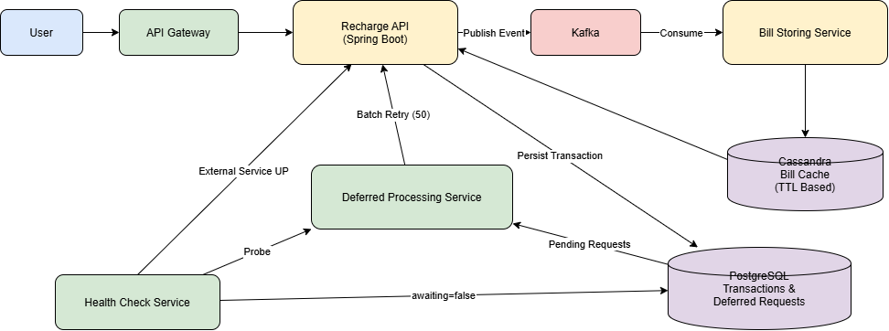
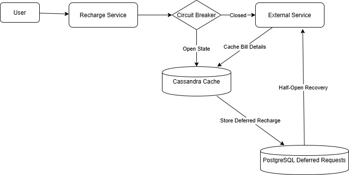

# HSBC: Recharge Failure Recovery System

## Overview

Designed and developed a resilient recharge failure recovery architecture using the Circuit Breaker pattern to ensure service continuity during external service outages.

## Technologies Used

* Java
* Spring Boot
* Resilience4j
* Kafka
* Cassandra
* PostgreSQL
* AWS (EC2, EBS, RDS, Auto Scaling Groups, Security Groups, CloudWatch)
* API Gateway
* Jenkins

## Problem Statement

External service outages caused recharge failures. Failed transactions meant the platform could not debit customer funds, resulting in the loss of **BBPS incentives** and **user platform charges**, while also impacting customer satisfaction due to unsuccessful recharges. These repeated retries overloaded downstream systems

## Business Impact

The solution improved business continuity, customer trust, and operational efficiency during external service outages.

* Increased revenue by accepting recharge requests even when external BBPS providers were unavailable, ensuring platform charges and partner incentives were not lost due to temporary outages.
* Improved customer trust and retention by allowing users to complete recharge requests during provider downtime, reducing the likelihood of customers switching to competing platforms.
* Reduced infrastructure and operational costs by preventing repeated retry attempts and cascading failures through the Circuit Breaker pattern, protecting downstream services from unnecessary load.
* Eliminated manual intervention by automatically recovering and processing pending recharge transactions once external services became available.

## Solution

To address this issue, the system was designed to:

* Display bill details to users using previously cached data.
* Accept recharge requests even when external services were unavailable.
* Update bill status in Cassandra for 2 payment scenarios: partial payment and full payment.
* Cache bill data with a** TTL** for each product, allowing customers to reuse previously fetched bill information.
* For example Cylinder, Bill details were cached in Cassandra for **35 days**. User-specific data was stored per customer, while the cylinder amount was determined by **city and gas provider**, enabling price updates to be reflected for all applicable users without calling the external service.
* Process pending recharge requests automatically once the external services recovered.
* Process deferred requests in configurable batches (typically **50 requests per batch**) to avoid overwhelming downstream systems after recovery.

## Key Responsibilities

* Gathered and analyzed client requirements to define project scope and solutions.
* Collaborated in resource planning and allocation based on project needs.
* Designed and developed Spring Boot microservices for recharge failure recovery workflows.
* Implemented circuit breaker-based resiliency mechanisms to handle external service downtime.
* Participated in the complete SDLC, including development, testing, production deployment, and post-production support.

## Architecture Decisions

### Why Kafka?

During production, the recharge service was handling around **100 TPS**. Initially, the average response time was around **600 ms**, which started increasing as traffic grew. The recharge API was performing **bill validation, incentive calculation, and downstream bill processing synchronously** within the user request. This became the primary bottleneck, requiring frequent horizontal scaling of the recharge service just to maintain response times. Configured Kafka with acks=all and replication factor 2 to ensure reliable message delivery and durability. Implemented automatic retries with Dead Letter Queue (DLQ) handling, revalidating external service availability before reprocessing failed transactions.

After analyzing the production metrics, I suggested introducing **Kafka** to decouple the synchronous processing from the user request flow.

This approach provided several benefits:

* **Reduced API response time** from approximately **600 ms to around 300 ms**, improving the customer experience.
* Decoupled services, allowing recharge and bill processing to evolve independently.
* Improved scalability, as Kafka consumers can scale horizontally based on message volume.
* Increased resilience, since temporary downstream failures do not directly impact the recharge service and events can be retried.

### Why Cassandra?

Cassandra was selected because it provides:

* Extremely high write throughput.
* Linear horizontal scalability.
* Automatic replication and fault tolerance.
* Efficient TTL-based data expiration.
* Low storage cost for multi-terabyte datasets.

#### Comparing Diffrent Storage Tools

* **Open-Source Alternative to Aerospike:** Cassandra provides enterprise-grade scalability, fault tolerance, and automatic data replication without licensing costs, helping reduce long-term operational expenses.
* **NoSQL over PostgreSQL:** A relational database like PostgreSQL was unnecessary because the data consists of independent key-value records with TTL (Time-To-Live). There are no relationships or complex joins, making a distributed NoSQL database a better fit.
* **High Write Throughput:** Optimized for write-heavy workloads using sequential disk writes, making it ideal for continuously storing bill data for several days.
* **Horizontal Scalability:** Nodes can be added seamlessly to handle increasing traffic and data volume while maintaining high availability.
* **Comparing Redis: **The system stored around **5 TB** of bill data. Cassandra provided scalable, disk-based storage at a lower cost, whereas Redis is optimized for in-memory caching and would have been significantly more expensive for persisting data at this scale.

## Technical Challenges

Several technical challenges were addressed during development:

* Preventing duplicate recharge processing during retries after external service recovery.
* Determining an appropriate TTL for different bill types to balance cache freshness and storage cost.
* Recovering thousands of deferred recharge requests without creating traffic spikes.
* Ensuring cached bill data remained consistent after partial and full payment scenarios.
* Balancing response time improvements while maintaining transaction reliability.

## Complexity of the Solution

The solution involved more than simply implementing a Circuit Breaker.

* Integration with multiple external biller services having different response behaviors.
* Handling high transaction volumes while maintaining low response times.
* Coordinating data across PostgreSQL, Cassandra, Kafka, and external services.
* Managing multiple recharge states such as pending, deferred, processing, success, and failure.
* Supporting automatic recovery without manual operational intervention.

## Three-Stage Recovery Process

### 1. Data Caching

Bill details from external services were cached in Cassandra during normal operations.

### 2. Failure Handling

During service outages:

* Cached bill details served within **50–80 ms**.
* Recharge requests were stored in PostgreSQL in a deferred state.

### 3. Recovery and Processing

* Service health was validated by sending test requests.
* Once the external service became available, deferred recharge requests were processed automatically.
* Batch processing limited to **500 requests per batch** with retry intervals to avoid downstream overload.

## Circuit Breaker States

Circuit Breaker was implemented using Resilience4j.

The open state was triggered when the external operator started rejecting requests or when response times increased beyond the configured threshold, resulting in higher waiting times for users. Once the failure rate crossed the allowed limit, the circuit breaker tripped to the open state and stopped sending further requests to the external service. This prevented repeated failures, reduced unnecessary load on the downstream system, and allowed the application to serve cached bill details and defer recharge requests safely.

| State     | Description                                                                                                            |
| --------- | ---------------------------------------------------------------------------------------------------------------------- |
| Closed    | Normal operations with direct external service calls. releasing the recharge request from deferred state in batches |
| Open      | Cached data from Cassandra was used, and recharge requests were stored in a deferred state.                            |
| Half-Open | Service recovery was validated by sending a 5 requests to external services in sliding window                          |

## Deployment Topology

The application was deployed on AWS EC2 instances behind AWS API Gateway.

Infrastructure included:

* EC2 for application hosting
* EBS for persistent storage
* RDS for PostgreSQL
* Auto Scaling Groups for high availability and traffic-based scaling
* Security Groups for network security
* CloudWatch for infrastructure monitoring and scaling triggers
* Jenkins for build, deployment, and release automation

Auto Scaling Groups were configured with a mix of On-Demand and Spot instances. Scaling policies were based on historical traffic patterns, allowing the system to increase Spot capacity during predictable high-traffic day and night windows. When CloudWatch alarms detected elevated load or threshold breaches, the scaling policy was updated and additional instances were launched automatically to maintain performance and availability.

Jenkins was used to automate the deployment pipeline, enabling consistent application releases across environments.

## API Gateway

API Gateway handled incoming client requests by providing:

* Request routing
* Rate limiting
* Request throttling
* Secure access to backend microservices

API Gateway routed requests to backend services running behind Auto Scaling Groups, ensuring that traffic was distributed efficiently across the application tier.

## Logging and Monitoring

* Kibana was used for centralized log analysis.
* Prometheus was used for alerting.
* Application logs older than three months were archived to Amazon S3.
* AWS CloudWatch monitored infrastructure health and triggered Auto Scaling Group policies for horizontal scaling.

## Microservice Patterns Used

* Circuit Breaker
* Event-Driven Architecture
* Asynchronous Messaging
* Database
* Retry and Recovery Processing
* Health Check Pattern

## Transaction Management

Designed a reliable transaction management mechanism to ensure recharge requests were never lost during external service outages.

* Implemented **idempotent transaction processing** using unique transaction IDs to prevent duplicate recharge requests.
* Persisted failed recharge requests in **PostgreSQL** with a **PENDING** status before responding to the customer.
* Used the **Circuit Breaker** state to determine whether requests should be processed immediately or deferred for later execution.
* Leveraged **Kafka** to asynchronously process deferred transactions once external services became available.
* Maintained transaction lifecycle using statuses such as **PENDING**, **PROCESSING**, **SUCCESS**, and **FAILED**, ensuring complete auditability.
* Enabled automatic recovery of pending transactions without manual intervention, guaranteeing reliable and consistent transaction processing.

##

## Architecture Diagram

## Circuit-Breaker

